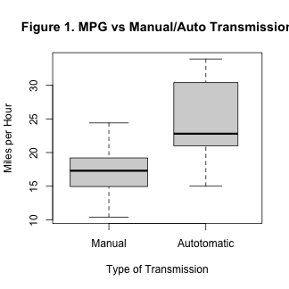
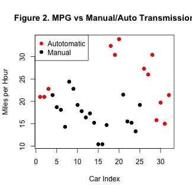
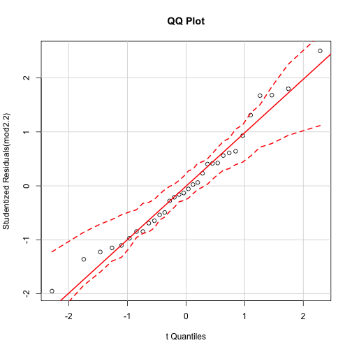
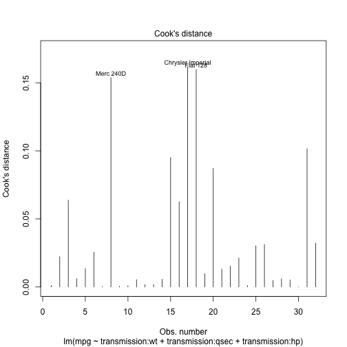

Relationship between Miles Per Gallon and Transmissions 
========================================================

This project investigates the relationship between Miles Per Gallon(MPG) and Type of Transmission. The mtcars dataset was used from 1974 Motor Trend US magazine. The aims of this project were as follows:

1. Find out if automatic or manual transmission better for MPG
2. Quantify how different MPG is between automatic and manual transmissions


--------------------------------------------------------
#### Preprocessing
The variables **number of cylinders (cyl)**, **number of forward gears (gear)** and **number of carburetors (carb)**  were changed to ordinal scales while **V/straight engine (vs)** and **transmission type (am)** were casted to dummy variables.

#### Exploratory Analysis
As shown on the boxplot (see Figure 1), manual transmission has a lower effect on mpg than autmatic transmission and the variiances are not constant as well; showing an estimated percent increase in mpg of 7.24 comparing automatic to manual transmission. A t-test confirms that the effects are different. The most fuel efficent cars were all light weighted with four-cylinder engines. Weight explaied fuel consumption better (with a correlation of 87%) than the other variables. But the other variables seem to also be involved. 

#### Model Selection
Since efficency on mpg could be influsenced by the other variables, linear models with the variables were fitted. All bivariate linear models were significant with respect to mpg. However, constructing a model with all regressors made all of the variables to be not sigificant (except for horsepower and weight (p-value ~ 0.1)). The R^2 was **0.89**, implying this model explained **89.31** of the variance. This suggested some factors were correlated and thus the need to control for interactions. 

Since the objective was to test the effect of trasmission type on mpg, only the interaction between transmission type and the other variables was considered. A model with all variables was made. The summary of this model showed that the engine type (vs), the number of cylinders variable, gear variable as well as the number of carburetors were redundant with cofficient values of NA. 

A model with just the ineraction between transmission type controling for interaction between weight and horsepower was evaluated since these two were significant on the first model (from above). The weight and speed of a car also seem to be important variables so a model with just these variable was constructed. In addition, a nested model search was done by adding the other covariates resulting in a total of 4 models. The ANOVA function created series of likelihood ratio with p-values that were not significant except for one; the model with covariates of weight, horse power and speed. The residuals the normal qqplot show the normality of the residuals.

#### Results
As can be seen below in the summary of the model, the main interacting variables are weight and speed (amount of time for 1/4 mile). The weight has a negative effect while speed follows the direction of mpg. Keeping speed constant,  the number of miles per galon will decrease by 7.9344 for cars with auto-transmission compared to 2.23 for manual-transmission. For each second,  an auto-transmission car takes it 1.36 less mile to run ¼ mile compared to 0.59 for manual-transmission cars. The heavir a car is, the more force it needs and the more gas it will use.

#### Conclusion
There is evidence supporting the claim that auto-transmission cars have better millage than the alternative after controlling for speed (acceleration), weight and horsepower.


```r
summary(mod2.2)
```

```
## 
## Call:
## lm(formula = mpg ~ transmission:wt + transmission:qsec + transmission:hp, 
##     data = myMtCars)
## 
## Residuals:
##    Min     1Q Median     3Q    Max 
## -3.584 -1.422 -0.163  0.870  4.248 
## 
## Coefficients:
##                              Estimate Std. Error t value Pr(>|t|)    
## (Intercept)                   18.2066     8.2219    2.21   0.0361 *  
## transmissionManual:wt         -2.2365     0.9197   -2.43   0.0225 *  
## transmissionAutotomatic:wt    -7.9344     1.6481   -4.81    6e-05 ***
## transmissionManual:qsec        0.5925     0.3933    1.51   0.1445    
## transmissionAutotomatic:qsec   1.3628     0.4254    3.20   0.0037 ** 
## transmissionManual:hp         -0.0213     0.0181   -1.18   0.2497    
## transmissionAutotomatic:hp     0.0132     0.0153    0.86   0.3966    
## ---
## Signif. codes:  0 '***' 0.001 '**' 0.01 '*' 0.05 '.' 0.1 ' ' 1
## 
## Residual standard error: 2.06 on 25 degrees of freedom
## Multiple R-squared:  0.906,	Adjusted R-squared:  0.883 
## F-statistic:   40 on 6 and 25 DF,  p-value: 1.23e-11
```


#### Appendex.
##### Codes and Figures.
Exploratory anaylsis.

```r
#pairs(myMtCars, panel = panel.smooth, main = "Car data", col = myMtCars$transmission)
myMtCars = data.frame(mtcars)
myMtCars$cyl <- ordered(myMtCars$cyl)
myMtCars$gear <- ordered(myMtCars$gear, labels=c("3","4","5"))
myMtCars$carb <- ordered(myMtCars$carb, labels=c("1","2","4","3","6","8"))
myMtCars$vs <- factor(myMtCars$vs, labels=c("V","Straight"))
myMtCars$transmission <- factor(mtcars$am, labels=c("Manual","Autotomatic"))
myMtCars <- myMtCars[, names(myMtCars) != "am"] # drop am variable
```

  


```r
wtCorr <- abs(round(cor(myMtCars$mpg, myMtCars$wt), 2) * 100)
t.test(myMtCars[myMtCars$transmission == "Manual", ]$mpg, myMtCars[myMtCars$transmission != 
    "Manual", ]$mpg)
```

```
## 
## 	Welch Two Sample t-test
## 
## data:  myMtCars[myMtCars$transmission == "Manual", ]$mpg and myMtCars[myMtCars$transmission != "Manual", ]$mpg
## t = -3.767, df = 18.33, p-value = 0.001374
## alternative hypothesis: true difference in means is not equal to 0
## 95 percent confidence interval:
##  -11.28  -3.21
## sample estimates:
## mean of x mean of y 
##     17.15     24.39
```

Model Selection


```r
mod1 <- lm(mpg ~ transmission * ., data = myMtCars)  # all
mod2 <- lm(mpg ~ transmission:disp + transmission:hp + transmission:drat + transmission:wt + 
    transmission:qsec, data = myMtCars)  # remove NA
mod2.0 <- lm(mpg ~ transmission:wt + transmission:hp, data = myMtCars)
mod2.1 <- lm(mpg ~ transmission:wt + transmission:qsec, data = myMtCars)
mod2.2 <- lm(mpg ~ transmission:wt + transmission:qsec + transmission:hp, data = myMtCars)
mod2.3 <- lm(mpg ~ transmission:wt + transmission:qsec + transmission:hp + transmission:disp, 
    data = myMtCars)
anova(mod2.0, mod2.2, mod2.3)  #sig
```

```
## Analysis of Variance Table
## 
## Model 1: mpg ~ transmission:wt + transmission:hp
## Model 2: mpg ~ transmission:wt + transmission:qsec + transmission:hp
## Model 3: mpg ~ transmission:wt + transmission:qsec + transmission:hp + 
##     transmission:disp
##   Res.Df RSS Df Sum of Sq    F Pr(>F)   
## 1     27 191                            
## 2     25 106  2      85.1 9.28 0.0011 **
## 3     23 105  2       0.7 0.08 0.9252   
## ---
## Signif. codes:  0 '***' 0.001 '**' 0.01 '*' 0.05 '.' 0.1 ' ' 1
```

```r
anova(mod2.1, mod2.2, mod2.3)
```

```
## Analysis of Variance Table
## 
## Model 1: mpg ~ transmission:wt + transmission:qsec
## Model 2: mpg ~ transmission:wt + transmission:qsec + transmission:hp
## Model 3: mpg ~ transmission:wt + transmission:qsec + transmission:hp + 
##     transmission:disp
##   Res.Df RSS Df Sum of Sq    F Pr(>F)
## 1     27 119                         
## 2     25 106  2     12.58 1.37   0.27
## 3     23 105  2      0.71 0.08   0.93
```

Diagnostics

```r
qqPlot(mod2.2, main = "QQ Plot")
```

 

```r
cutoff <- 4/((nrow(myMtCars) - length(mod2.2$coefficients) - 2))
plot(mod2.2, which = 4, cook.levels = cutoff)
```

 

